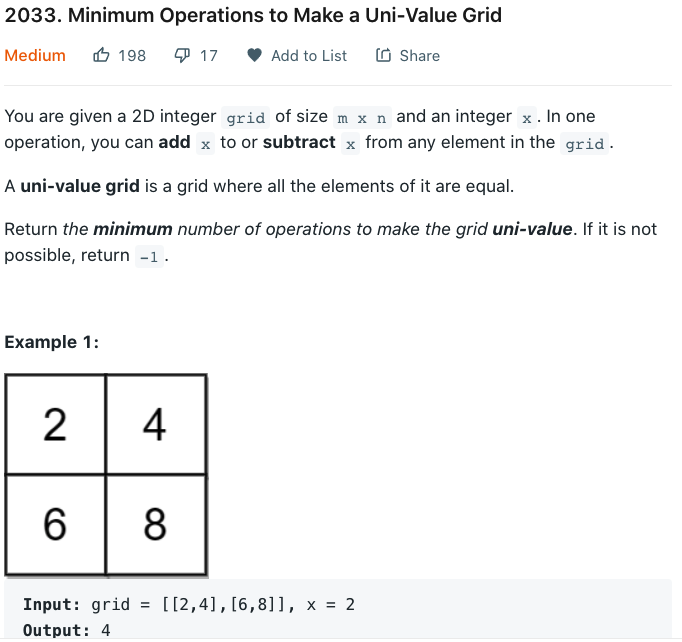

[**346. Moving Average from Data Stream - Easy**](https://leetcode.com/problems/moving-average-from-data-stream/)

if size is less than given size 
1) push to the front 

else
* pop from the back 
* push to the front 

&nbsp; 
```cpp
class MovingAverage {
    std::deque<int> nums;
    int windowsize = -1; 
public:
    MovingAverage(int size) {
        windowsize = size; 
    }
    
    double next(int val) {
        if(nums.size() < windowsize){
            nums.push_front(val);
        }

        else{
            nums.pop_back();
            nums.push_front(val);
            assert(nums.size() == windowsize); 
        }

        int sum = std::accumulate(std::begin(nums), std::end(nums), 0);

        return double(double(sum)/nums.size());
    }   
};

/**
 * Your MovingAverage object will be instantiated and called as such:
 * MovingAverage* obj = new MovingAverage(size);
 * double param_1 = obj->next(val);
 */
```


---
---
[**2033. Minimum Operations to Make a Uni-Value Grid**](https://leetcode.com/problems/minimum-operations-to-make-a-uni-value-grid/)
<!--  -->
you don't need to add or subtract x, but you have the option to

&nbsp; 

```cpp
class Solution {
public:
    int minOperations(vector<vector<int>>& grid, int x) {
        std::vector<int> nums; 
        nums.reserve(grid[0].size() * grid.size());
        for(auto& row: grid){
            nums.insert(std::end(nums), std::begin(row), std::end(row));
        }

        assert(nums.size() == grid[0].size() * grid.size());
        if(nums.size() == 1)
            return 0; 
        std::sort(std::begin(nums), std::end(nums));

        //left to right: 
        //make sure that each number to the left of me can be  
        //turned into me by some number of x's added to it

        vector<int> memo(nums.size());
        for(int i = 1; i < nums.size(); ++i){
            int diff = nums[i] - nums[i-1];
            if(diff % x != 0)
                return -1; 
            memo[i] = memo[i-1] + (i)*(diff/x); 
        }

        //right to left: 
        //how many operations does it take for all the numbers to the right 
        //of me to be equal to me? 

        int numOps = 0;
        int minOps = INT_MAX;
        for(int i = nums.size() - 1; i >= 0; --i){

            if(i == nums.size() - 1){
                minOps = memo[i];
            }

            else{
                int diff = nums[i+1] - nums[i];
                numOps += ((nums.size() - 1 - i) * diff/x ); 
            }

            minOps = std::min(minOps, memo[i] + numOps);
        }

        return minOps; 
    }
};
```
---
---
[**1048. Longest String Chain-Medium**](https://leetcode.com/problems/longest-string-chain/)

sort words vector by length of the words

store the longest chain starting at word for each word

&nbsp; 
```cpp
class Solution {
    int globalmax = 1; 
    bool isPredecessor(const string& wordone, const string& wordtwo){
        assert(wordone.length() + 1 == wordtwo.length());
        int left = 0, right = 0; 
        while(left < wordone.length() and right < wordtwo.length()){
            if(wordone[left] == wordtwo[right]){
                ++left; 
            }    
            ++right;

            if(std::abs(left-right) > 1)
                return false; 
        }
        

        return true;
    }
public:
    int longestStrChain(vector<string>& words) {
        std:sort(std::begin(words), std::end(words), 
            [](const string& first, const string& second){
             return first.size() < second.size(); 
        });

        vector<int> maxChainAtWord(words.size(), 1); 

        for(int i = words.size() -2; i >= 0; --i){
            int len = words[i].length(); 
            int localmaxchain = 1; 
            for(int j = i + 1; j < words.size(); ++j){
                int lentwo = words[j].length();
                if(lentwo > len + 1)
                    break; 
                if(lentwo == len)
                    continue; 
                if(isPredecessor(words[i], words[j])){
                    localmaxchain = std::max(localmaxchain, maxChainAtWord[j] + 1);
                }
            }

            maxChainAtWord[i] = localmaxchain; 
            globalmax = std::max(globalmax, localmaxchain);
        }
        return globalmax; 
    }
};
```

---
---
### WRONG: redo later

&nbsp; 

the pq is ordered by endtime of the interval

in cpp, the pq are by default max pq's 

```cpp
class Solution {
    typedef std::pair<int,int> P; 
    struct Order{
        bool operator()(P const& a, P const& b){
            return a.second < b.second; 
        }
    };
    std::priority_queue<P, vector<P>, Order> pq; 
public:
    vector<vector<int>> merge(vector<vector<int>>& intervals) {
        std::sort(std::begin(intervals), std::end(intervals));

        for(int i = 0; i < intervals.size(); ++i){
            if(pq.empty())
                pq.push(std::make_pair(intervals[i].first, intervals[i].second));
            else{
                if(intervals[i].first <= pq.top().second){
                    pq.top().second = intervals[i].second; 
                }
                else{
                    pq.push(std::make_pair(intervals[i].first, intervals[i].second));
                }
            }
        }

        vector<vector<int>> results; 
        while(not pq.empty()){
            vector<int> temp = {pq.top().first, pq.top().second}
            results.push_back(temp);
            pq.pop();
        }

        return results; 
    }
};
```